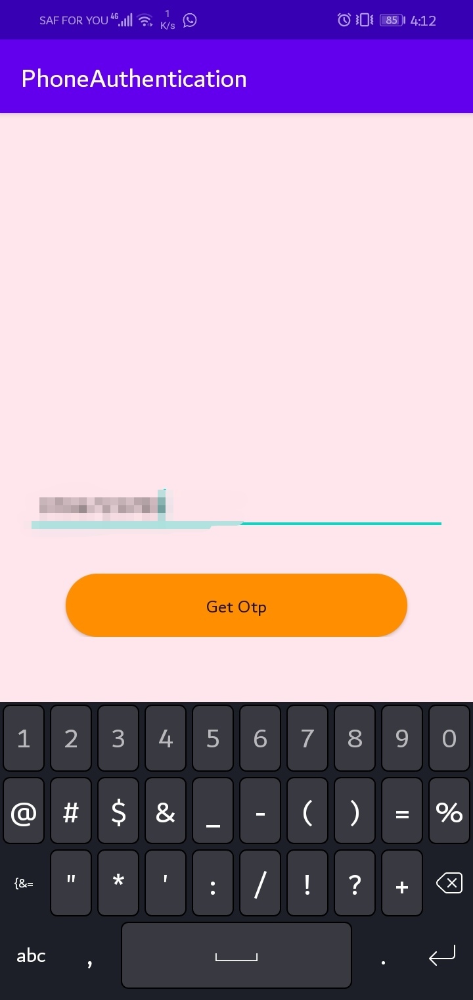
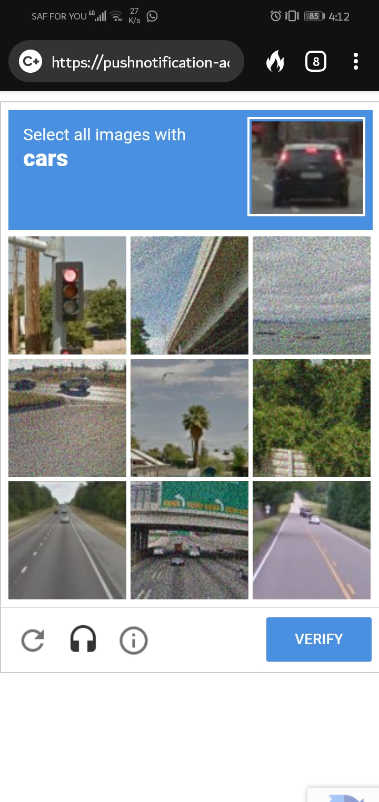
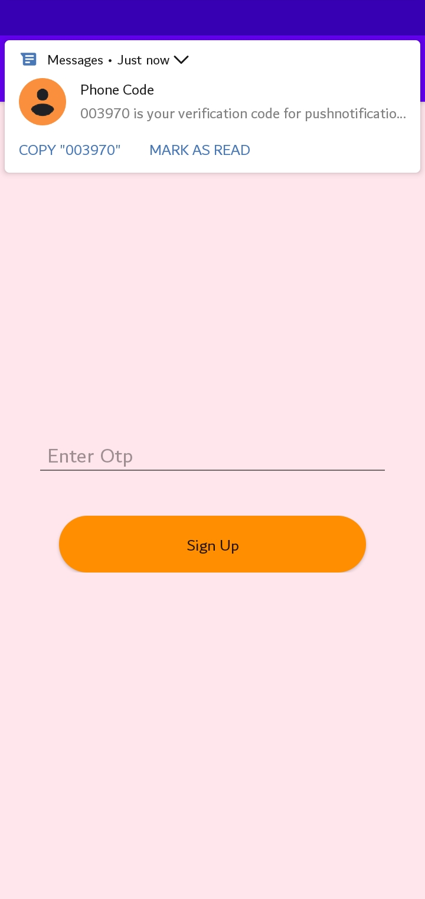
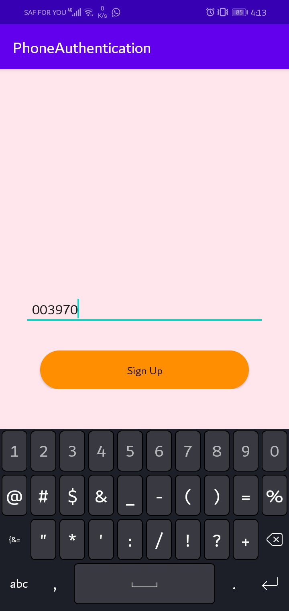

## FreeWroa Android Interview

_______

# Login Phone Authentication

## Description
You can use Firebase Authentication to sign in a user by sending an SMS message to the user's phone. The user signs in using a one-time code contained in the SMS message.

The easiest way to add phone number sign-in to your app is to use FirebaseUI, which includes a drop-in sign-in widget that implements sign-in flows for phone number sign-in, as well as password-based and federated sign-in.

## Running the app

1. Clone the repo to your machine [Phone Authentication](https://github.com/FreeWroad/Android-interview.git)

2. Run the project on Android Studio and set sync the project with gradle files.

3. Run the app on your device and let it install

4. Turn on Mobile data and input your mobile number.

5. Run the recapcha and press continue to be sent a login code form your phone

 

